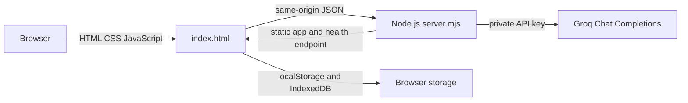

# Outfit Roulette Project Report

**Report date:** 2026-09-30  
**Repository:** [umesh2904x/Outfit-Roulette](https://github.com/umesh2904x/Outfit-Roulette)  
**Application:** [Local demo](http://127.0.0.1:4173/)  
**Docker Hub namespace:** `umesh290406` (publishing requires a repository secret)

## Summary

Outfit Roulette is a browser-based outfit assistant. It accepts a daily schedule, an optional styling direction and an optional wardrobe list/photo, then requests three ranked looks from Groq. Users can save looks in browser storage. The repo includes a Node.js API proxy so the Groq key is not shipped to the browser.

## Architecture



The server allows only the two configured Groq models, limits request bodies, times out upstream calls, and exposes a health endpoint that reports whether AI is configured without returning the key.

## Source and configuration

- `index.html`: responsive UI, preference/schedule form, wardrobe-photo handling, generated outfit cards, and lookbook.
- `server.mjs`: static server, health endpoint, and authenticated Groq proxy.
- `tests/server.test.mjs`: Node built-in HTTP integration tests with a mocked upstream; no API key or network call is needed.
- `.github/workflows/ci.yml`: syntax check, tests, Docker image build, container HTTP smoke test, and optional Docker Hub publishing.
- `Dockerfile` / `.dockerignore`: unprivileged Node image and safe build context.
- `.env.example`: placeholder configuration only. Real `.env` files and the legacy backup are excluded from Git and Docker contexts.

For local AI use, copy `.env.example` to `.env` and set a newly generated `GROQ_API_KEY`. Never commit or share a key. A previously exposed key must be revoked.

## Implementation steps

1. Install Node.js 20 or newer.
2. Create `.env` from `.env.example` and add a private Groq API key.
3. Run `npm start` and open `http://127.0.0.1:4173`.
4. Run `npm run check` and `npm test` before changes are published.
5. GitHub Actions builds and smoke-tests Docker on pushes to `main` and pull requests.
6. To publish the image, add a Docker Hub access token as the GitHub Actions secret `DOCKERHUB_TOKEN`. The workflow then publishes `umesh290406/outfit-roulette:latest` and a commit-SHA tag.

## Screenshots

- Home page: 
- Outfit form: 

## Verification evidence

Local verification on Node.js 24.14.0:

```text
npm run check: passed
npm test: 6 passed, 0 failed
```

The six tests cover static page/security headers, health state with and without a key, the helpful unconfigured-AI response, malformed JSON and unsupported models, a mocked authenticated Groq proxy response, and 404 handling.

The latest GitHub Actions run passed on commit `3e1fef94fd0af9c046e5e9827d7b24b9109bcfd2`: [CI run 36758450188](https://github.com/umesh2904x/Outfit-Roulette/actions/runs/36758450188). Its test/build job passed syntax checking, all six backend tests, the Docker image build, and the running-container health/homepage smoke test. The container ran ephemerally on the GitHub-hosted runner; this is not a public deployment.

Docker Engine is not installed in the development environment, so a local image build/container run was not possible. GitHub Actions provides the verified Docker build and ephemeral runtime evidence instead. Docker Hub publishing is optional and requires the `DOCKERHUB_TOKEN` repository secret; without it, the workflow intentionally skips pushing an image.

## Deliverable status

| Deliverable | Status |
| --- | --- |
| Application source | Complete |
| GitHub repository and commit history | Complete |
| GitHub Actions CI | Complete; latest workflow run linked above |
| Tests | Complete; six local tests pass |
| Dockerfile and image build | Complete; image build passed in CI |
| Running container evidence | Complete for CI smoke run; not a persistent deployment |
| Public deployment | Deferred |
| Prometheus/Grafana dashboard | Deferred |
| Final presentation and live demo | Deferred |

## Conclusion

The source repository, local run instructions, automated backend checks, screenshots, container definition, and CI pipeline are prepared. Public deployment, external monitoring, and presentation/demo remain separate follow-up work as requested.
