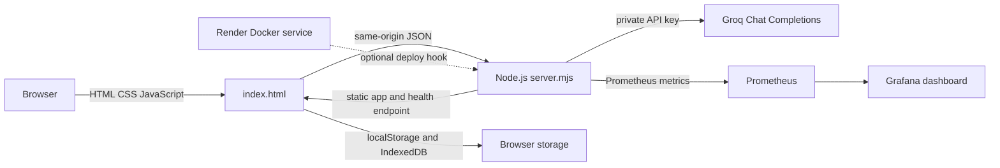
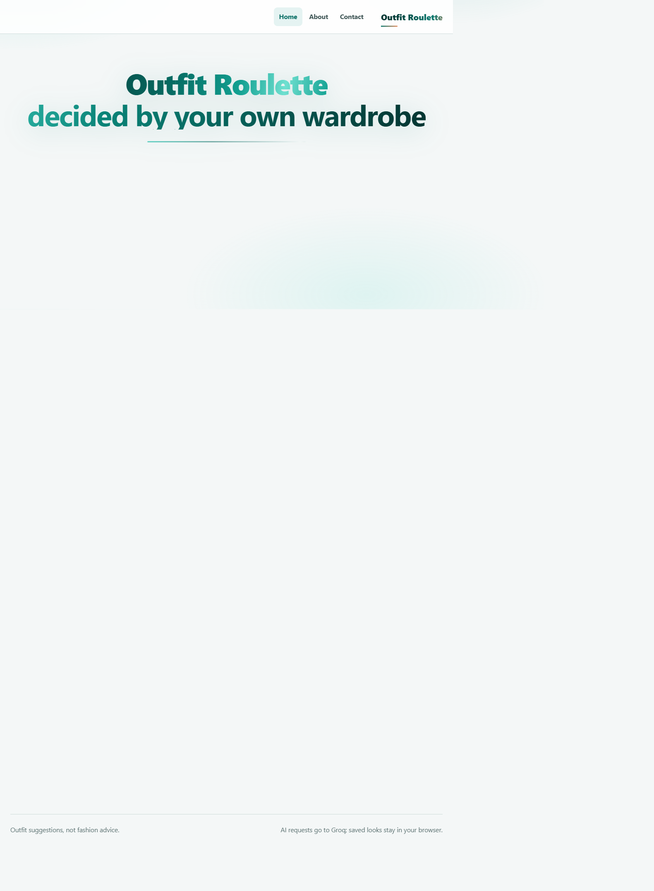
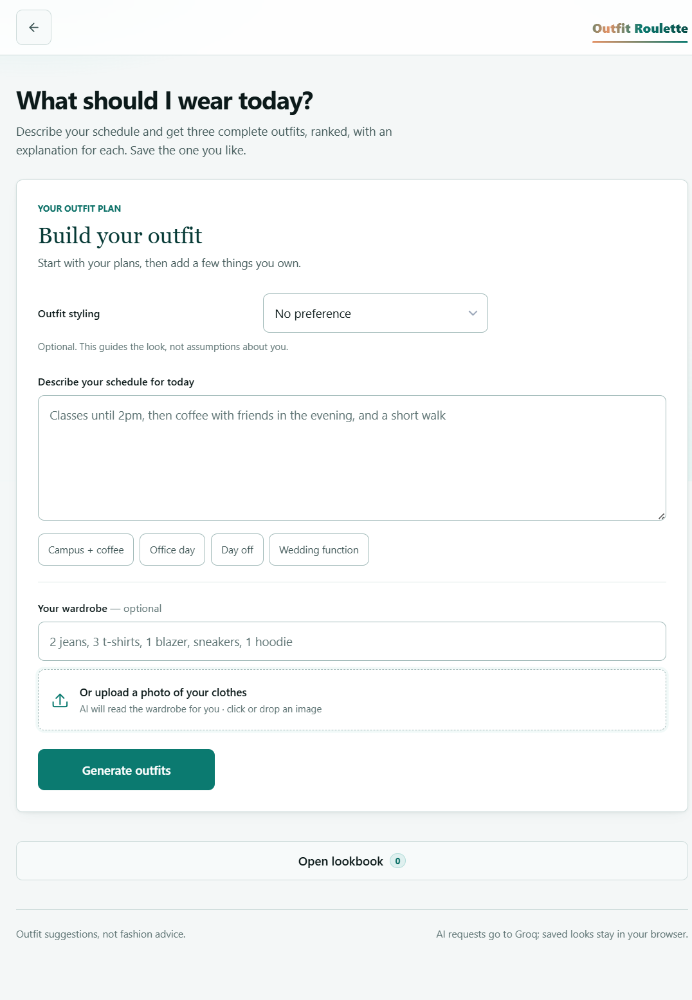

# Outfit Roulette Project Report

**Report date:** 2026-10-01
**Repository:** [umesh2904x/Outfit-Roulette](https://github.com/umesh2904x/Outfit-Roulette)  
**Application:** [Local demo](http://127.0.0.1:4173/)  
**Docker Hub namespace:** `umesh290406` (publishing requires a repository secret)

## Summary

Outfit Roulette is a browser-based outfit assistant. It accepts a daily schedule, an optional styling direction and an optional wardrobe list/photo, then requests three ranked looks from Groq. Users can save looks in browser storage. The repo includes a Node.js API proxy so the Groq key is not shipped to the browser.

## Architecture



The server allows only the two configured Groq models, limits request bodies, times out upstream calls, and exposes health and Prometheus metrics without returning the key. Metrics cover bounded route/status request counters, latency buckets, AI configuration, uptime and process RSS.

## Source and configuration

- `index.html`: responsive UI, preference/schedule form, wardrobe-photo handling, generated outfit cards, and lookbook.
- `server.mjs`: static server, health/metrics endpoints, and authenticated Groq proxy.
- `tests/server.test.mjs`: Node built-in HTTP integration tests with a mocked upstream; no API key or network call is needed.
- `.github/workflows/ci.yml`: syntax check, tests, Docker image build, container HTTP smoke test, and optional Docker Hub publishing.
- `Dockerfile` / `.dockerignore`: unprivileged Node image and safe build context.
- `docker-compose.yml` and `monitoring/`: Prometheus/Grafana provisioning and a five-panel service-health dashboard.
- `render.yaml`: Render Docker Blueprint, health check and private Groq key prompt.
- `docs/presentation.html`: keyboard-navigable project walkthrough.
- `.env.example`: placeholder configuration only. Real `.env` files and the legacy backup are excluded from Git and Docker contexts.

For local AI use, copy `.env.example` to `.env` and set a newly generated `GROQ_API_KEY`. Never commit or share a key. A previously exposed key must be revoked.

## Implementation steps

1. Install Node.js 20 or newer.
2. Create `.env` from `.env.example` and add a private Groq API key.
3. Run `npm start` and open `http://127.0.0.1:4173`.
4. Run `npm run check` and `npm test` before changes are published.
5. GitHub Actions builds and smoke-tests Docker on pushes to `main` and pull requests.
6. To publish the image, add a Docker Hub access token as the GitHub Actions secret `DOCKERHUB_TOKEN`. The workflow then publishes `umesh290406/outfit-roulette:latest` and a commit-SHA tag.
7. For local monitoring, set a private `GRAFANA_PASSWORD` in `.env`, then run `docker compose up --build -d`.
8. For Render, create a Blueprint from `render.yaml`, set `GROQ_API_KEY` in Render, and add its deploy hook as the `RENDER_DEPLOY_HOOK` Actions secret.

## Screenshots

- Home page: 
- Outfit form: 

## Verification evidence

Local verification on Node.js 24.14.0:

```text
npm run check: passed
npm test: 7 passed, 0 failed
```

The seven tests cover static page/security headers, health state with and without a key, Prometheus metrics and process gauges, the helpful unconfigured-AI response, malformed JSON and unsupported models, a mocked authenticated Groq proxy response, and 404 handling.

The earlier GitHub Actions run passed on commit `3e1fef94fd0af9c046e5e9827d7b24b9109bcfd2`: [CI run 36758450188](https://github.com/umesh2904x/Outfit-Roulette/actions/runs/36758450188). It verified syntax, six backend tests, Docker image build, and the running-container health/homepage smoke test. The monitoring/metrics additions require the next Actions run for CI verification; follow [current workflow runs](https://github.com/umesh2904x/Outfit-Roulette/actions). The container test is ephemeral and is not a public deployment.

Docker Engine is not installed in the development environment, so Compose/Grafana could not be started locally. The dashboard and scrape configuration are present but still need a Docker-enabled runtime to show live metrics. Docker Hub publishing is optional and requires the `DOCKERHUB_TOKEN` repository secret; Render deployment requires the Render service, a rotated Groq key and the `RENDER_DEPLOY_HOOK` secret.

## Deliverable status

| Deliverable | Status |
| --- | --- |
| Application source | Complete |
| GitHub repository and commit history | Complete |
| GitHub Actions CI | Workflow configured; latest run linked above |
| Tests | Complete; seven local tests pass |
| Dockerfile and image build | Complete; previously built in CI; current code awaits next CI run |
| Running container evidence | Previous CI smoke passed; current code awaits next CI run; not a persistent deployment |
| Prometheus/Grafana configuration and dashboard | Complete; live dashboard awaits Compose runtime |
| Render deployment configuration | Complete; public URL awaits Render service and secrets |
| HTML presentation | Complete; live presentation/demo not yet delivered |

## Conclusion

The repository now contains source, CI, tests, Docker/Compose, Prometheus/Grafana dashboard configuration, Render deployment configuration, screenshots and a browser-based presentation. Current code has seven passing local tests. Public hosting, live Grafana and the live presentation/demo require the stated services, secrets or Docker-enabled environment.
